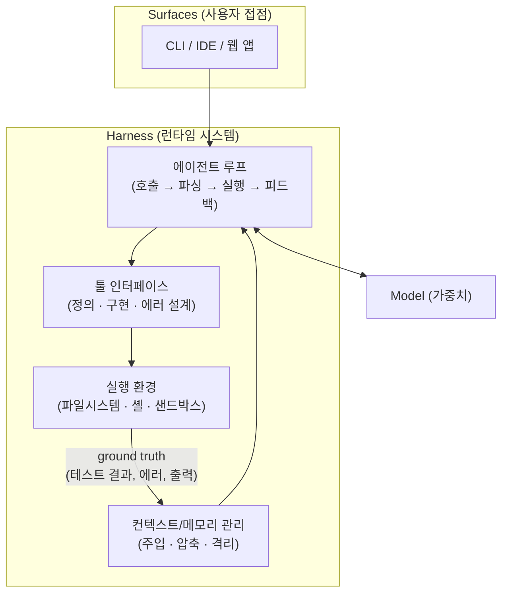
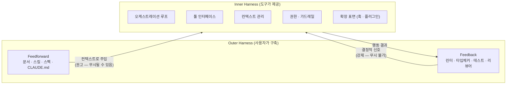
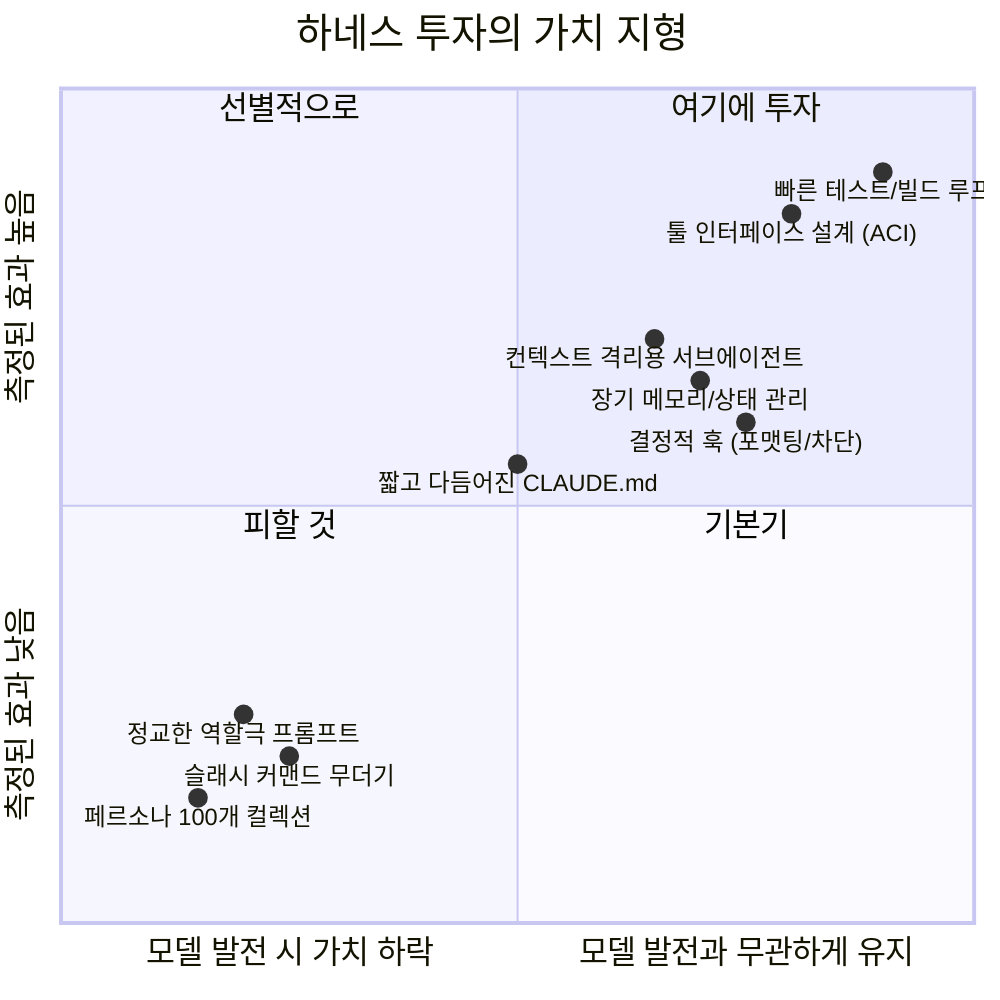

# 하네스 엔지니어링, 우리는 지금 무엇을 만들고 있는가

## 0. 들어가며

에이전트 코딩 도구에게 일을 더 잘 시키고 싶다면 무엇부터 손대야 할까? 요즘 커뮤니티의 답은 꽤 명확해 보인다. 서브에이전트 역할 정의를 잔뜩 만들고, 슬래시 커맨드를 수십 개 깔고, 훅과 MCP 서버를 붙인 다음 이것을 "내 하네스(my harness)"라고 부르는 것이다. GitHub에는 `security-auditor`, `react-optimizer`, `database-architect` 같은 페르소나 파일을 154개씩 모아둔 컬렉션 레포가 수만 스타를 받고 있고, "에이전트 135개에 커맨드 42개짜리 셋업"이 하네스 엔지니어링의 모범 사례처럼 공유된다.

그런데 여기서 두 가지 질문이 생긴다. 첫째, Anthropic이나 OpenAI 같은 랩들이 말하는 harness도 정말 같은 것을 가리키는가? 둘째, 설령 그렇게 부르기로 한다 쳐도, 역할셋과 커맨드를 늘리는 것이 실제로 에이전트의 성능을 올리는 투자인가?

이 글은 2026년 7월 시점의 웹 리서치를 바탕으로 이 두 질문을 따라가 본다. 결론을 미리 말하자면 둘 다 "아니오"에 가깝다. 다만 그 이유가 꽤 흥미롭고, 커뮤니티가 왜 그렇게 흘러갔는지에도 나름의 구조적인 사정이 있다.

## 1. 하네스라는 말의 원래 의미

harness는 원래 말(馬)에게 씌우는 마구(馬具)를 뜻하는 단어다. 힘 좋은 동물에게 장구를 채워서 그 힘을 마차 끄는 일에 연결하는 도구다. AI 에이전트 맥락에서의 하네스도 정확히 이 은유 위에 서 있다. 모델이라는 힘을 실제 작업 환경에 연결하는 장치, 그것이 하네스다.

이 단어를 쓰는 1차 소스들을 추적해 보면 정의가 놀랍도록 일관된다. 가장 깔끔한 공식은 OpenAI의 Gabriel Chua가 2026년 2월에 정리한 것이다.

> **Codex = Model + Harness + Surfaces**

Model은 가중치, Harness는 지시문과 툴의 집합(그리고 그것을 움직이는 실행 루프), Surfaces는 사용자가 만지는 CLI·IDE·앱이다.[^1] 여기서 특히 눈여겨볼 문장이 하나 있다. *"Codex models are trained in the presence of the harness."* — 툴 사용, 실행 루프, 컴팩션, 반복 검증은 나중에 덧붙인 행동이 아니라 모델이 그 안에서 학습한 환경이라는 것이다. 하네스와 모델은 서로를 향해 공진화한다.

Anthropic은 자체 문서에서 harness 대신 "scaffolding"이라는 단어를 선호하는데, 내용은 같다. SWE-bench 관련 포스트에서 이렇게 설명한다.

> "이 scaffolding은 모델에 들어가는 프롬프트를 생성하고, 모델 출력을 파싱해 행동으로 옮기고, 이전 행동의 결과가 다음 프롬프트에 반영되는 상호작용 루프를 관리한다. 같은 모델이라도 scaffolding에 따라 에이전트 성능이 크게 달라진다."[^2]

Simon Willison은 더 간명하게 "코딩 에이전트란 LLM의 하네스 역할을 하는 소프트웨어"라고 정의한다.[^3] LangChain의 Harrison Chase는 여기에 메모리와 컨텍스트 관리를 하네스의 핵심 책임으로 못박는데 — 정확히는 Letta의 Sarah Wooders의 말("컨텍스트, 그리고 곧 메모리의 관리는 에이전트 하네스의 핵심 역량이자 책임이다")을 Chase가 인용하며 "닫힌 하네스를 쓰면, 특히 API 뒤에 있다면, 당신의 메모리를 당신이 소유하지 못한다"고 덧붙인다.[^4] 학술 쪽에서도 정리가 나왔는데, Fudan 등의 "Agentic Harness Engineering" 논문은 하네스를 "모델 외부의 편집 가능한 컴포넌트 집합"으로 정의하고 시스템 프롬프트, 툴 설명, 툴 구현, 미들웨어, 스킬, 서브에이전트 설정, 장기 메모리의 일곱 가지 직교 컴포넌트로 분류했다.[^5]

그림으로 그리면 이런 구조다.

이 그림에서 가장 중요한 것은 맨 아래의 화살표다. 하네스의 존재 이유는 모델이 매 스텝 환경으로부터 ground truth — 테스트 결과, 에러 메시지, 실제 출력 — 를 돌려받게 하는 데 있다. Anthropic의 표현을 빌리면 "실행 중 에이전트가 각 단계에서 환경으로부터 'ground truth'(툴 호출 결과, 코드 실행 결과 등)를 얻어 진행 상황을 판단하는 것이 결정적으로 중요하다."[^6]

물론 이 정의 안에서도 역할셋과 슬래시 커맨드는 하네스의 구성요소이긴 하다(위 일곱 분류의 "스킬"과 "서브에이전트 설정"에 해당한다). 하지만 그것이 하네스의 본체 — 루프, 툴 구현, 컨텍스트 관리, 환경 — 와 동일시될 수는 없다. 마구 전체가 아니라 안장에 달린 주머니 정도의 위치인 셈이다.

## 2. 커뮤니티에서는 무슨 일이 벌어지고 있나

그렇다면 커뮤니티는 왜 마크다운 파일 컬렉션을 하네스라고 부르게 되었을까. 먼저 실태부터 보자. 2026년 7월 기준으로 이런 레포들이 있다.[^7]

| 레포 | 규모 | 내용 |
|---|---|---|
| hesreallyhim/awesome-claude-code | ~47.8k ★ | 스킬·훅·커맨드·오케스트레이터 큐레이션 |
| VoltAgent/awesome-claude-code-subagents | ~22.7k ★ | 서브에이전트 페르소나 154+개 (10개 카테고리) |
| davila7/claude-code-templates | ~28.4k ★ | 에이전트·커맨드·MCP·훅 템플릿 마켓플레이스 |
| FlorianBruniaux/claude-code-ultimate-guide | ~5.3k ★ | 워크플로·훅·스킬·MCP 가이드, 430K+ 라인 |
| rohitg00/awesome-claude-code-toolkit | ~2.2k ★ | 에이전트 135개, 커맨드 42개, 플러그인 176+개 |

전형적인 "my harness" 공유 포스트는 CLAUDE.md 메모리 아키텍처, 스킬 50~200개, 훅 몇 개, MCP 서버 목록, 그리고 서브에이전트 페르소나 무더기로 구성된다. 이쯤 되면 하네스라기보다 수집품 진열장에 가깝지만, 이렇게 흘러간 데에는 구조적인 이유가 있다.

첫째, **만질 수 있는 것이 그것뿐이다.** 진짜 하네스 — 루프, 툴 구현, 컨텍스트 관리 — 는 Claude Code나 Codex가 이미 제공하며 닫혀 있다. 사용자가 편집할 수 있는 표면은 마크다운 파일뿐이니, 만질 수 있는 것이 곧 "하네스"라고 불리게 된 것이다.

둘째, **눈에 잘 보이고 공유하기 쉽다.** "커맨드 74개"는 스크린샷과 스타를 부르지만 "테스트 스위트를 3초 안에 돌게 만들었다"는 그렇지 않다. 성능에 기여하는 것은 후자인데 말이다.

셋째, **아무도 측정하지 않는다.** 대형 컬렉션 레포 중 측정된 생산성 데이터를 제시하는 곳은 사실상 없다. 유통되는 수치("50% faster", "2x speed")는 출처가 불분명한 전언이 대부분이다.

이 간극을 이해하는 데 유용한 프레임이 하나 있다. **inner harness / outer harness** 구분이다.[^8]

inner harness는 도구가 제공하는 런타임이고, outer harness는 사용자가 그 주변에 쌓는 것이다. 그런데 outer harness에도 두 방향이 있다. 프롬프트로 미리 주입하는 feedforward(문서, 스킬, CLAUDE.md)와, 행동 결과에 대해 되돌아오는 feedback(린터, 테스트, 타입체커)이다. 커뮤니티의 컬렉션 문화는 이 중 feedforward 쪽에 심하게 편중되어 있다. 문제는 feedforward가 본질적으로 권고(advisory)라는 점이다. LLM은 프롬프트 지시를 대략 20% 정도 무시한다는 추정이 있고,[^9] 이 무시는 멀티스텝 작업에서 복리로 누적된다. 반면 feedback은 강제다. 테스트가 빨간불이면 모델이 그것을 무시할 방법이 없다.

## 3. 어느 쪽이 맞는 걸까

판단부터 말하면, **"역할셋과 커맨드를 넓히는" 방향이 아니라 "환경과 검증 루프를 조이는" 방향이 맞다.** 근거는 세 갈래다.

### 3.1 페르소나 컬렉션은 알려진 실패 모드와 정면으로 충돌한다

컨텍스트에 무언가를 넣으면 모델은 그것에 주의를 기울여야 한다. 공짜가 아니라는 뜻이다. Drew Breunig가 정리한 컨텍스트 실패 유형 중 "context confusion"이 정확히 이 지점을 짚는다. 같은 모델(양자화된 Llama 3.1 8b)이 툴 19개일 때는 과제를 통과했는데 46개를 주자 실패했다는 사례가 있고, Berkeley Function-Calling Leaderboard에서도 툴 수가 늘수록 모든 모델의 성능이 떨어지는 경향이 관찰된다.[^10] 쓰지 않는 정의도 자리를 차지하고 주의를 분산시킨다.

Anthropic 공식 문서조차 "비대해진 CLAUDE.md 파일은 정작 중요한 지시를 무시하게 만든다"를 명명된 실패 패턴("The over-specified CLAUDE.md")으로 등재하고, 각 줄에 대해 이렇게 자문하라고 권한다. *"이 줄을 지우면 Claude가 실수하게 되는가? 아니라면 지워라."*[^11]

그리고 페르소나 자체에 대한 오해가 있다. Cognition(Devin 팀) Walden Yan의 "Don't Build Multi-Agents"가 정리했듯, 서브에이전트의 진짜 가치는 **컨텍스트 격리와 병렬성**이지 역할극이 아니다.[^12] `security-auditor` 페르소나가 잘 작동하는 것처럼 보이는 이유는 보안 전문가를 연기해서가 아니라, 깨끗한 별도 컨텍스트에서 좁은 과제를 받았기 때문이다. 같은 효과는 잘 쓴 일회성 프롬프트로도 얻는다.

### 3.2 성능을 실제로 움직인 요인은 일관되게 환경 쪽이다

실증 데이터가 가리키는 방향은 상당히 일관적이다.

Princeton의 SWE-agent 논문은 에이전트 성능의 주요 지렛대가 프롬프트 정교화가 아니라 ACI(agent-computer interface) 설계임을 보였다. 성능을 올린 것은 편집 시 린터 통합(빼면 3.0%p 하락), 100줄 단위로 제한된 파일 뷰어, "명령이 성공적으로 실행되었고 출력이 없습니다" 같은 빈 출력에 대한 명시적 피드백이었다. 사람에게 IDE가 필요하듯 에이전트에게도 전용 인터페이스가 필요하다는 이야기다.[^13]

Anthropic도 SWE-bench 에이전트를 만들며 "전체 프롬프트보다 툴 최적화에 실제로 더 많은 시간을 썼다"고 밝혔다.[^14] 대표적인 사례가 poka-yoke 설계다. 문자열 치환 edit 툴이 old_str과 정확히 1건 매치될 때만 실행되고 아니면 에러를 돌려주게 만든 것[^15] — 실수를 프롬프트로 타이르는 게 아니라 인터페이스 수준에서 불가능하게 만든 것이다.

앞서 언급한 AHE 논문의 결과는 더 직접적이다. 하네스 자동 개선 10회 반복으로 Terminal-Bench 2 pass@1을 69.7%에서 77.0%로 올렸는데, 컴포넌트 절제 실험(ablation) 결과 이득은 툴·미들웨어·장기 메모리 각각에서 나왔고 시스템 프롬프트 단독으로는 오히려 점수가 떨어졌다. 논문의 결론이 이 글의 논지를 한 줄로 요약한다. *"사실적 하네스 구조는 과제와 모델을 건너 이전되지만, 산문 수준의 전략은 그렇지 않다(factual harness structure transfers across tasks and models whereas prose-level strategy does not)."*[^16]

이것을 실무 격언으로 압축하면 이렇게 된다. **에이전트가 스스로 돌릴 수 있는 검증 수단(테스트, 빌드, 스크린샷 비교)이 세션의 성패를 가른다.** 검증 루프가 없으면 사람이 검증 루프가 된다. 모든 실수가 사람이 발견해줄 때까지 얌전히 대기하는 것이다.[^17]

### 3.3 프롬프트 팩은 감가상각이 빠른 자산이다

마지막 근거는 시간축에 있다. 정교한 역할 프롬프트는 결국 현재 모델의 약점을 손으로 보정하는 작업이다. Sutton의 bitter lesson — "우리가 생각한다고 생각하는 방식을 시스템에 심는 것은 장기적으로 통하지 않는다" — 이 그대로 적용되는 지점이다.[^18] browser-use 팀은 이를 명시적으로 실증했는데, 수천 줄짜리 엘리먼트 추출기·DOM 인덱서·클릭 래퍼를 버리고 약 600줄의 최소 하네스에 모델의 원시 접근을 열어주는 쪽이 이겼다. 그들의 표현을 빌리면: *"Don't wrap the LLM. Don't wrap its tools either."*[^19]

손으로 튜닝한 프롬프트에는 부채의 성격도 있다. Breunig는 이를 "prompt debt"라고 부르는데, 원하는 행동이 모델의 훈련과 어긋날 때 지시를 반복하며 "가중치와 싸우는(fighting the weights)" 일이 벌어지고, 그 결과물은 특정 모델의 거동에 잠기고 팀원에게 불투명해진다.[^20] 모델 버전만 올렸는데 성능이 떨어지는 일도 실제로 있다 — Voiceflow는 gpt-3.5-turbo의 마이너 버전 이동만으로 의도 분류 성능이 10% 떨어졌다고 보고했다.[^21]

업계의 방향도 같다. 모델이 좋아질수록 하네스는 얇아지는 추세이고, 2026년 2월 Amp 팀이 낸 "The Coding Agent Is Dead" — "최신 모델들에서는 모델을 감싸는 프롬프트와 툴, 즉 에이전트가 더 이상 제한 요인이 아니다" — 라는 글이 상징적이다.[^22] 반면 빠른 테스트 스위트, 명확한 에러를 돌려주는 CLI, 샌드박스는 어떤 모델이 와도 가치가 유지된다. 애초에 사람 개발자에게도 가치 있는 자산이기 때문이다.

### 3.4 종합하면

투자 가치의 지형을 그려보면 다음과 같다.

한 문장으로 정리하면 이렇다. **역할셋 50개는 하네스가 아니라 하네스 위에 얹힌 설정 파일 더미이고, 좋은 하네스 엔지니어링은 "에이전트가 현실로부터 얼마나 빨리 피드백을 받는가"를 설계하는 일이다.**

오해는 말자. 슬래시 커맨드와 서브에이전트가 무가치하다는 이야기가 아니다. 자주 반복되고 검증 가능한 워크플로를 소수만 캡슐화할 때는 분명히 유용하다. 문제는 방향이다. 컬렉션의 크기를 하네스의 완성도로 착각하는 순간, 우리는 마차를 빨리 달리게 하는 대신 안장 주머니를 수집하고 있는 것이다.

## 4. 실제 프로젝트에서는 무엇을 챙겨야 하나

그래서 실제로 outer harness에 투자한다면 무엇부터 해야 할까. 수익률이 높은 순서로 짚어본다.

**첫 번째는 피드백 루프다.** 에이전트가 스스로 돌릴 수 있는 빠른 테스트·빌드·린트를 만드는 것이 가장 수익률 높은 투자다. 이것이 "지켜봐야 하는 세션"과 "맡기고 자리를 뜰 수 있는 세션"의 차이를 만든다. 테스트가 느리다면 그것부터 고치자. 에이전트는 사람보다 훨씬 자주 돌린다. UI 작업이라면 스크린샷 비교, API 작업이라면 curl 가능한 로컬 서버 — 매체가 무엇이든 "돌려보고 확인할 수단"을 쥐여주는 것이 핵심이다.

**두 번째는 툴과 환경의 설계다.** 에러 메시지가 명확한 CLI를 우선하자. 정교한 MCP 서버보다 `--help`가 잘 나오는 CLI 하나가 나은 경우가 많다(GitHub 공식 MCP 하나만으로도 수만 토큰의 컨텍스트를 잡아먹는 것으로 유명하다[^23]). 그리고 실수를 인터페이스 수준에서 차단하자. 절대 경로 강제, 정확히 1건 매치일 때만 실행되는 치환, 빈 결과에 대한 의미 있는 메시지 같은 것들이다. 위험한 작업은 샌드박스나 워크트리로 격리한다.

**세 번째는 컨텍스트 관리다.** CLAUDE.md는 짧게 유지하고 자주 다듬는다. 판정 기준은 앞서 나온 그 질문 하나면 충분하다 — 이 줄을 지우면 에이전트가 실수하는가? 아니라면 지운다. 스킬은 필요할 때만 로드되는 구조로 두고, 항상 컨텍스트에 상주하는 지시를 최소화한다. 서브에이전트는 격리와 병렬성을 위해 쓴다. 탐색으로 메인 컨텍스트가 오염되는 것을 막는 용도이지, 페르소나 다양성을 위한 것이 아니다.

**네 번째, 훅은 보장이 필요한 곳에만 쓴다.** 프롬프트 지시는 권고이고 모델은 일정 비율로 무시한다. 반드시 일어나야 하는 것(포맷팅, 위험 명령 차단, 커밋 전 검사)은 훅으로 결정론적으로 강제하고, 판단이 필요한 것은 프롬프트로 남긴다. Anthropic 문서의 표현대로 "CLAUDE.md 지시가 권고인 것과 달리 훅은 결정론적이며 그 동작이 일어남을 보장한다."[^24]

**다섯 번째, 커맨드와 역할셋은 소수만, 검증 가능하게.** 슬래시 커맨드는 자주 반복되고, 절차가 안정되고, 결과를 검증할 수 있는 워크플로에만 만든다. 컬렉션을 통째로 설치하는 것은 피하자. 쓰지 않는 정의도 유지보수 부채이고, 커뮤니티 스킬 팩은 공급망 공격 표면이기도 하다(악성 스킬 패턴이 실제로 수백 건 카탈로그화되어 있다). 남의 컬렉션에서 가져올 것은 파일이 아니라 패턴이다.

**여섯 번째는 측정이다.** 하네스를 바꿨으면 효과를 잴 수단이 있어야 한다. 거창한 eval 프레임워크가 아니어도 된다. 대표 과제 5~10개를 골라두고 변경 전후로 돌려보는 수준이면 시작으로 충분하다. "실패한 제품들은 거의 항상 하나의 공통 근본 원인을 공유한다: 견고한 평가 체계를 만들지 못한 것"이라는 Hamel Husain의 진단은 개인 하네스에도 그대로 적용된다.[^25] 측정 없는 하네스 튜닝은 엔지니어링이 아니라 수집이다.

**마지막으로, 갈아엎기를 두려워하지 말자.** 모델이 업그레이드되면 기존 보정용 지시들은 불필요해지거나 오히려 해로워진다. 주기적으로 CLAUDE.md와 훅을 백지에서 다시 써보는 것이 좋다. 에이전트가 같은 지시를 반복해서 어긴다면, 지시를 늘릴 것이 아니라 컨텍스트를 줄이거나(파일이 너무 길다는 신호다) 그 지시를 훅으로 옮길 때다.

## 5. 마치며

하네스라는 단어가 마구에서 왔다는 이야기로 돌아가 보자. 좋은 마구의 조건은 장식의 개수가 아니라, 말의 힘이 손실 없이 바퀴에 전달되는가였다. 에이전트의 하네스도 마찬가지다. 모델의 능력이 손실 없이 실제 작업에 전달되려면 필요한 것은 페르소나 100개가 아니라, 에이전트가 자기 행동의 결과를 즉시 확인할 수 있는 환경이다.

커뮤니티의 컬렉션 문화가 이해되지 않는 것은 아니다. 만질 수 있는 표면이 마크다운뿐이었고, 눈에 보이는 것이 공유되기 마련이다. 하지만 실증 데이터가 가리키는 방향은 분명하다. 프롬프트로 타이르는 것보다 인터페이스로 막는 것이 낫고, 미리 주입하는 권고보다 행동 뒤에 돌아오는 강제된 피드백이 낫고, 오늘 모델의 약점을 보정하는 산문보다 어떤 모델이 와도 유효한 구조가 낫다.

그러니 다음에 "하네스를 개선하고 싶다"는 생각이 들면, 새 서브에이전트 정의 파일을 만들기 전에 이 질문을 먼저 던져보면 어떨까. **"내 에이전트는 자기가 방금 한 일이 맞았는지 스스로 확인할 수 있는가?"** 이 질문에 "아니오"라면, 만들어야 할 것은 페르소나가 아니라 3초 안에 도는 테스트다.

## 6. 참고자료 및 링크

### 각주

[^1]: Gabriel Chua (OpenAI, Developer Experience Engineer), "How I think about Codex". Simon Willison의 소개 글 경유: <https://simonwillison.net/2026/Feb/22/how-i-think-about-codex/>. 원문에서 하네스는 "the collection of instructions and tools"로 정의되며, 인용문 전문은 "Codex models are trained in the presence of the harness. Tool use, execution loops, compaction, and iterative verification aren't bolted on behaviors — they're part of how the model learns to operate."

[^2]: Anthropic, "Raising the bar on SWE-bench Verified" (2025.1): <https://www.anthropic.com/research/swe-bench-sonnet>. 원문: "This scaffolding is responsible for generating the prompts that go into the model, parsing the model's output to take action, and managing the interaction loop..." / "The performance of an agent on SWE-bench can vary significantly based on this scaffolding, even when using the same underlying AI model." 같은 글의 설계 철학: "give as much control as possible to the language model itself, and keep the scaffolding minimal."

[^3]: Simon Willison, "How coding agents work": <https://simonwillison.net/guides/agentic-engineering-patterns/how-coding-agents-work/>. 원문: "A coding agent is a piece of software that acts as a harness for an LLM, extending that LLM with additional capabilities that are powered by invisible prompts and implemented as callable tools."

[^4]: Harrison Chase (LangChain), "Your Harness, Your Memory" (2026.4): <https://www.langchain.com/blog/your-harness-your-memory>. "Managing context, and therefore memory, is a core capability and responsibility of the agent harness"는 Chase가 인용한 Sarah Wooders(Letta 공동창업자)의 발언이다. Chase 본인의 문장: "If you use a closed harness, especially if it's behind an API, you don't own your memory."

[^5]: Jiahang Lin et al., "Agentic Harness Engineering: Observability-Driven Automatic Evolution of Coding-Agent Harnesses" (Fudan University 외): <https://arxiv.org/abs/2604.25850>. 원문: "This collection of model-external, editable components is collectively referred to as the agent's harness." 7개 컴포넌트: "system prompt, tool description, tool implementation, middleware, skill, sub-agent configuration, and long-term memory."

[^6]: Anthropic, "Building Effective Agents" (2024.12): <https://www.anthropic.com/research/building-effective-agents>. 원문: "During execution, it's crucial for the agents to gain 'ground truth' from the environment at each step (such as tool call results or code execution) to assess its progress."

[^7]: 스타 수는 2026년 7월 3일 GitHub API 기준: hesreallyhim/awesome-claude-code 47,815 ★; VoltAgent/awesome-claude-code-subagents 22,739 ★ (README 기준 "154+ Claude Code subagents across 10 categories"); davila7/claude-code-templates 28,425 ★; FlorianBruniaux/claude-code-ultimate-guide 5,301 ★; rohitg00/awesome-claude-code-toolkit 2,239 ★ (레포 설명 기준 "135 agents, ..., 42 commands, 176+ plugins").

[^8]: "Harnesses Explained: The Inner and Outer Workings of the Coding Agent Harness" (codagent): <https://codagent.beehiiv.com/p/harnesses-explained>. inner/outer 명명은 Nathaniel Whittemore, feedforward/feedback 구분은 Birgitta Böckeler의 프레임을 인용한 것이다.

[^9]: 같은 글. 원문: "The ECC project's chief-of-staff agent docs estimate that LLMs ignore prompt instructions roughly 20% of the time. And failures compound. Even at 99% per-step success — a far more generous estimate — a 20-step process lands at 82% end-to-end." 20%는 실측이 아닌 한 프로젝트 문서의 추정치임에 유의.

[^10]: Drew Breunig, "How Long Contexts Fail" (2025.6): <https://www.dbreunig.com/2025/06/22/how-contexts-fail-and-how-to-fix-them.html>. 원문: "When they only gave the model 19 tools, it succeeded." / "When the team gave a quantized (compressed) Llama 3.1 8b a query with all 46 tools it failed." / "The leaderboard shows that every model performs worse when provided with more than one tool."

[^11]: Anthropic, Claude Code Best Practices: <https://code.claude.com/docs/en/best-practices>. 원문: "The over-specified CLAUDE.md. If your CLAUDE.md is too long, Claude ignores half of it because important rules get lost in the noise." / "Keep it concise. For each line, ask: 'Would removing this cause Claude to make mistakes?' If not, cut it."

[^12]: Walden Yan (Cognition), "Don't Build Multi-Agents" (2025.6): <https://cognition.com/blog/dont-build-multi-agents>. 원문: "Actions carry implicit decisions, and conflicting decisions carry bad results."

[^13]: John Yang et al., "SWE-agent: Agent-Computer Interfaces Enable Automated Software Engineering" (NeurIPS 2024): <https://arxiv.org/abs/2405.15793>. 린터 절제 실험: "without linting, 15.0% ↓ 3.0". 빈 출력 피드백: "Your command ran successfully and did not produce any output." IDE 유비: "Just as humans benefit from powerful software applications, such as integrated development environments... LM agents... would benefit from specially-built interfaces to the software they use."

[^14]: Anthropic, "Building Effective Agents". 원문: "While building our agent for SWE-bench, we actually spent more time optimizing our tools than the overall prompt." (SWE-bench 포스트가 아니라 이 글이 출처다.)

[^15]: Anthropic, "Raising the bar on SWE-bench Verified". 원문: "The replacement will only occur if there is exactly one match of `old_str`. If there are more or fewer matches, the model is shown an appropriate error message for it to retry."

[^16]: "Agentic Harness Engineering" (앞의 논문). 원문: "ten iterations lift pass@1 from 69.7% to 77.0%" / "A component ablation pinpoints where this gain lives: tools, middleware, and long-term memory each carry the improvement on their own, while the system prompt alone regresses." / "...indicating that factual harness structure transfers across tasks and models whereas prose-level strategy does not."

[^17]: Anthropic, Claude Code Best Practices. 원문: "Without a check it can run, 'looks done' is the only signal available, and you become the verification loop: every mistake waits for you to notice it."

[^18]: Richard Sutton, "The Bitter Lesson" (2019): <http://www.incompleteideas.net/IncIdeas/BitterLesson.html>. 원문: "We have to learn the bitter lesson that building in how we think we think does not work in the long run."

[^19]: Gregor Zunic (browser-use), "The Bitter Lesson of Agent Harnesses" (2026.4): <https://browser-use.com/posts/bitter-lesson-agent-harnesses>. 이전 세대는 "thousands of lines of element extractors, DOM indexers, click wrappers"였고 현행 하네스는 "~600 lines total".

[^20]: Drew Breunig, "The Problem Is Prompt Debt" (2026.6): <https://www.dbreunig.com/2026/06/22/the-problem-is-prompt-debt.html>. 원문: "Repeating instructions propels us towards prompt debt, but it's necessary when the behavior we want is at odds with a model's training. This is fighting the weights..."

[^21]: Eugene Yan 외, "Applied LLMs — What We've Learned From A Year of Building with LLMs", §2.2.2: <https://applied-llms.org/>. 원문: "Voiceflow found that migrating from gpt-3.5-turbo-0301 to gpt-3.5-turbo-1106 led to a 10% drop in their intent classification task."

[^22]: Amp, "The Coding Agent Is Dead" (2026.2.19): <https://ampcode.com/news/the-coding-agent-is-dead>. 원문: "With the newest models, the agent — the prompts and tools you wrap around a model — is no longer the limiting factor."

[^23]: Simon Willison, "Claude Skills are awesome, maybe a bigger deal than MCP" (2025.10): <https://simonwillison.net/2025/Oct/16/claude-skills/>. 원문: "GitHub's official MCP on its own famously consumes tens of thousands of tokens of context..."

[^24]: Anthropic, Claude Code Best Practices. 원문: "Unlike CLAUDE.md instructions which are advisory, hooks are deterministic and guarantee the action happens."

[^25]: Hamel Husain, "Your AI Product Needs Evals": <https://hamel.dev/blog/posts/evals/>. 원문: "I've found that unsuccessful products almost always share a common root cause: a failure to create robust evaluation systems."

### 그 외 참고자료

- **Dex Horthy (HumanLayer), "12-Factor Agents"** — 프로덕션 에이전트를 "대부분은 그냥 소프트웨어"로 짓는 12원칙. 프레임워크로 70~80% 품질까지는 빠르게 가지만 마지막 20%에서 역공학이 필요해진다는 "프레임워크 함정" 논의가 백미. <https://github.com/humanlayer/12-factor-agents>
- **Lance Martin (LangChain), "Context Engineering for Agents"** — 컨텍스트 관리를 Write/Select/Compress/Isolate 네 전략으로 체계화한 글. 본문 3장의 컨텍스트 논의를 실무 기법 수준으로 확장해 준다. <https://www.langchain.com/blog/context-engineering-for-agents>
- **CodeAct 논문 (ICML 2024)** — "실행 가능한 코드를 행동 공간으로 쓰면 인터프리터가 곧 검증기"라는, 검증 루프 논지의 학술적 근거. <https://arxiv.org/abs/2402.01030>
- **Anthropic, "Building Effective Agents"** — 각주에서 부분 인용했지만 전문을 읽을 가치가 있다. 에이전트 패턴 분류와 ACI 개념의 원전. <https://www.anthropic.com/research/building-effective-agents>
- **Techstackups, "Coding Agent Harness Comparison 2026"** — Pi(툴 4개, 시스템 프롬프트 1천 토큰 미만)부터 Claude Code(1만+ 토큰 오케스트레이션)까지 하네스 두께 스펙트럼을 조망하는 비교 자료. <https://techstackups.com/comparisons/coding-agent-harness-comparison-2026/>
- **Hamel Husain, "Fuck You, Show Me The Prompt"** — LLM 추상화 프레임워크가 실제로 어떤 프롬프트를 보내는지 가로채서 까보는 글. "만질 수 있는 표면" 아래에서 무슨 일이 벌어지는지 직접 확인하는 태도의 표본. <https://hamel.dev/blog/posts/prompt/>

---

## 알림

- 이 글은 2026년 7월 2일 시점의 웹 리서치를 바탕으로 작성되었으며, 모든 직접 인용과 수치는 7월 3일에 원문 대조로 검증했다. 스타 수 등 수치는 검증 시점 기준이다.
- 이 글의 리서치 및 작성에는 Anthropic Claude가 활용되었다.
